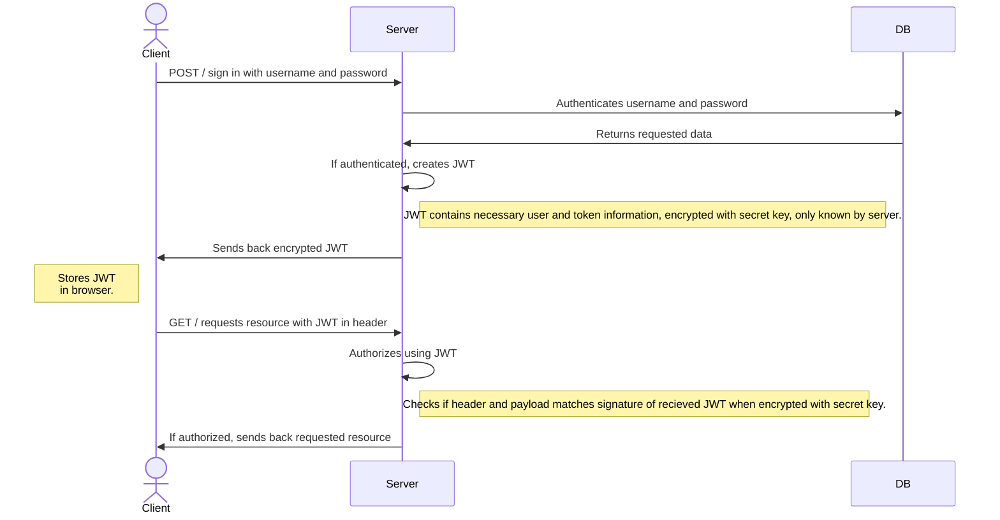

# One Source Frontend

This is the Frontend repository for a school project to learn how to go from development to production with different environments and ci/cd pipeline. There is also a [One Source Backend repository](https://github.com/nillali/heroku-test) which is connected to this one.

# TTFHW - Instructions

## Frontend
```
cd <your-workspace>  
git clone https://github.com/AnnaToll/one-source-fe.git    
cd one-source-fe  
npm install
npm start  
``` 
## Tester  
```bash
npm test # Unit test  
npm componenttest # Component test  
npm integrationtest # Integration test  
npm browsertest # Browser test
``` 

***

# Onboarding
Languages
```
- HTML
- JAVASCRIPT
- CSS
```

Packages & Frameworks
```
- NodeJS
- React
- Express  
- Nodemon  
- Cors
- Jest
- dotenv
- Mongoose
```
# Docker
To test and develop the application in Docker, create a docker-compose.yaml file in the rootfolder of the [One Source Backend repository](https://github.com/nillali/heroku-test) and add the following code: 
```yaml
version: "3.8"
services:
  server:
    image: annatoll/one-source-server
    container_name: api_c
    environment:
      - dbURI=mongodb+srv://<user-name>:<pwd>@cluster0.wtkif.mongodb.net/OneSourceComponentTest?retryWrites=true&w=majority
      - userName=/api/v0/user-name
      - PORT=4000
    ports:
      - '4000:4000'
    volumes:
      - ./heroku-test:/app
      - ./app/node_modules
  frontend:
    image: annatoll/one-source-app
    container_name: one-source-fe_c
    environment:
      - REACT_APP_API_ADDRESS=http://localhost:4000
    ports: 
      - '3000:3000'
    stdin_open: true
    tty: true  
```
# JWT - Instructions

