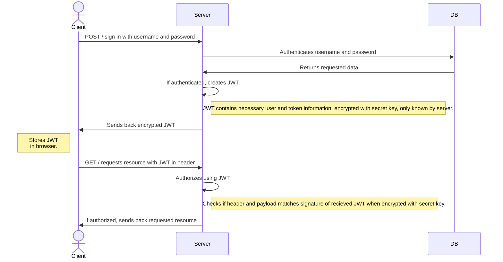

# One Source Frontend

This is the Frontend repository for a school project to learn how to go from development to production with different environments and ci/cd pipeline. There is also a [One Source Backend repository](https://github.com/nillali/heroku-test) which is connected to this one.

# TTFHW - Instructions

## Frontend
```
cd <your-workspace>  
git clone https://github.com/AnnaToll/one-source-fe.git    
cd one-source-fe  
npm install
npm start  
``` 
## Tester  
```bash
npm test # Unit test  
npm componenttest # Component test  
npm integrationtest # Integration test  
npm browsertest # Browser test
``` 

***

# Onboarding
Uizard
```
https://app.uizard.io/p/69ad0e55
```

Languages
```
- HTML
- JAVASCRIPT
- CSS
```

Packages & Frameworks
```
- NodeJS
- React
- Express  
- Nodemon  
- Cors
- Jest
- dotenv
- Mongoose
```
# API documentation
To access the API documentation, run backend in the environment of your choice, and navigate to (your-backend-environment.com)/api-docs.
# Docker
1. To test and develop the application in Docker, create a docker-compose.yaml file (locally on your computer) in the rootfolder of the [One Source Backend repository](https://github.com/nillali/heroku-test) and paste: 
```yaml
version: "3.8"
services:
  server:
    build: ./
    container_name: one-source-server_c
    environment:
      - dbURI=mongodb+srv://<user-name-test-db>:<pwd-test-db>@cluster0.wtkif.mongodb.net/OneSourceComponentTest?retryWrites=true&w=majority
      - userName=/api/v0/user-name
      - PORT=4050
    ports:
      - '4050:4050'
    volumes:
      -  ./:/app
      - ./app/node_modules
  frontend:
    image: annatoll/one-source-app
    container_name: one-source-app_c
    environment:
      - REACT_APP_API_ADDRESS=http://localhost:4050
    ports: 
      - '3000:3000'
    stdin_open: true
    tty: true  
```
2. In the MongoDB connection string, add the correct username and password for the test database.
3. Open Docker Desktop and run:
```bash
cd <backend-repository>
docker-compose up
```
# Helpful snippets
```bash
docker-compose down --rmi all -v # Stops conntainers, and also removes all containers and images in Docker created with docker-compose up
heroku git:remote -a <project-name> # Add connection to a Heroku server
git remote rm heroku # Removes the current connection to Heroku
git remote add origin <remote-url> # Add connection to a Github repo
git remote rm <remote-url> # Remove connection to a Github repo
```
# JWT - Instructions

